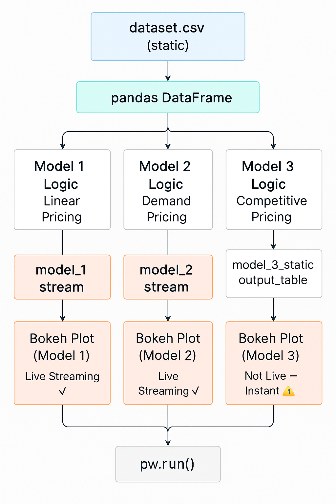

# 🚗 Dynamic Pricing for Urban Parking Lots  
**Summer Analytics 2025 Capstone Project**

This project implements a real-time, demand-driven dynamic pricing system for 14 urban parking lots using a live data stream. Built using Pathway and Bokeh, it allows real-time visualizations of three models responding to live occupancy and demand conditions.

---

## 📊 Models Implemented

### 1. **Model 1 – Linear Occupancy-Based Pricing**
- `Price = Base + α * (Occupancy / Capacity)`
- Simple and reactive to current occupancy.

### 2. **Model 2 – Demand-Based Pricing**
- Demand Score = weighted sum of:
  - Occupancy
  - Queue Length
  - Vehicle Type
  - Nearby Traffic
  - Special Events
- Maps to price range [10, 15] using a non-linear curve.

### 3. **Model 3 – Competitive Pricing**
- For each lot, checks nearby competitors (within 0.5 km).
- Reduces price if another nearby lot is cheaper.
- Uses Haversine formula to compute lat-long distances.

---

## 🧠 Assumptions

- Occupancy data is streamed row by row.
- All inputs are normalized and bounded for pricing.
- Demand is calculated only for bike and car types.
- Competitors are only lots ≤ 0.5 km away.

---

## 📦 Tech Stack

| Tool     | Purpose                      |
|----------|------------------------------|
| **Pathway** | Stream processing engine     |
| **Bokeh**   | Real-time visualization     |
| **Panel**   | Multi-tab dashboards        |
| **Pandas/Numpy** | Data preprocessing   |

---

## 🧠 System Architecture

## 📈 Real-Time Visualizations

- Live Bokeh plots for each model (Model 1, 2)
- Tabs for each parking lot's individual behavior

---

## 📂 Files
- `Dynamic_Pricing_Urban_Parking_Solution.ipynb`: Main notebook + bokeh plot 
- `A_flowchart_diagram_in_digital_graphic_format_illu.png`: Architecture diagram

---

## 👤 Author

- Name: Vivan Khatri
- Submitted: **July 6, 2025**

